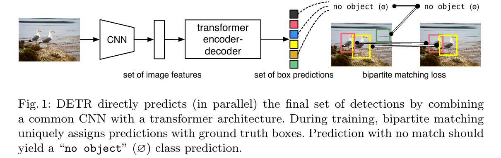
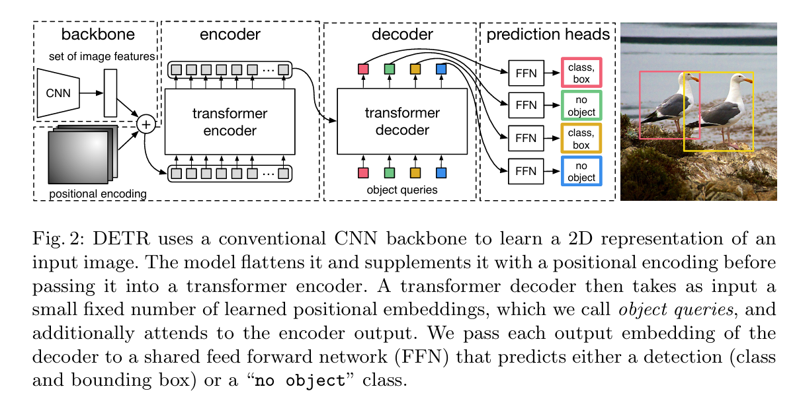
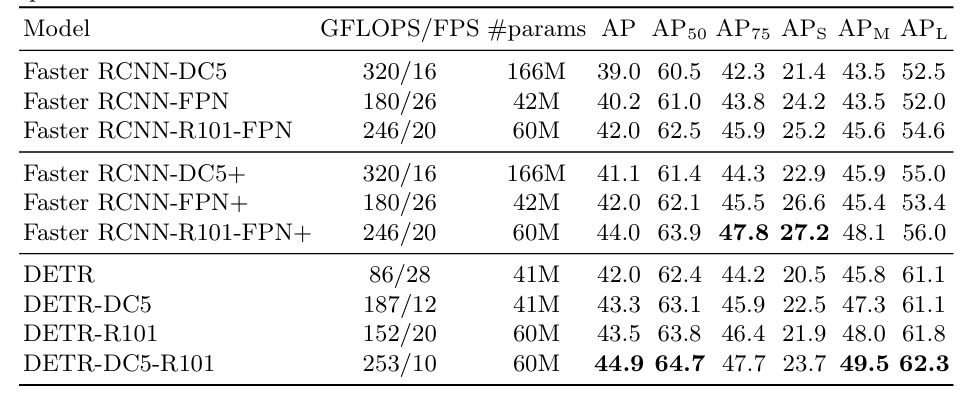
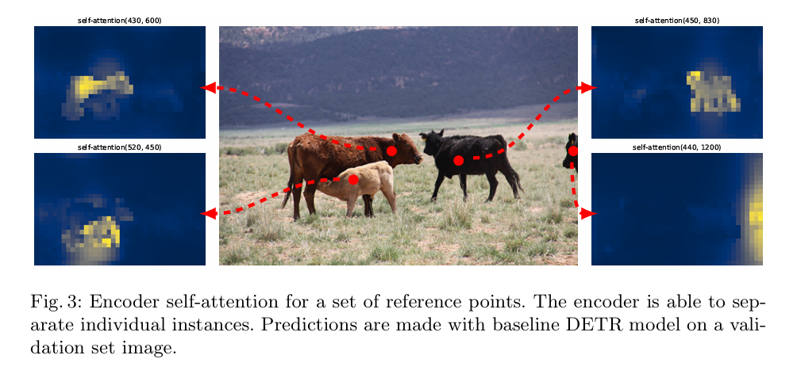
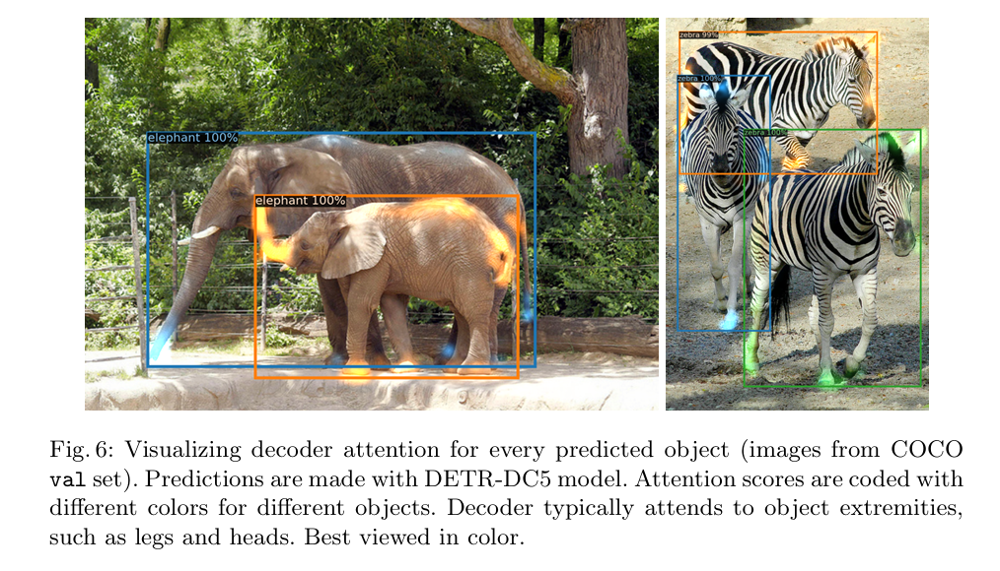
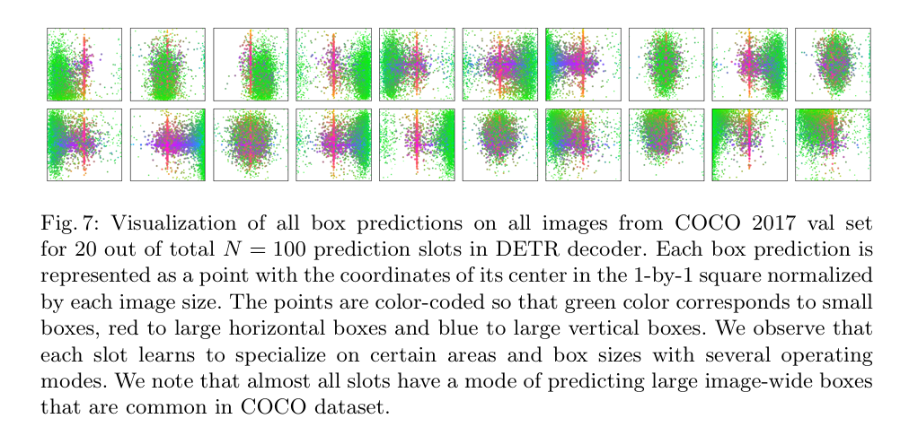

DETR（DEtection TRansformer）是 Carion 等人在 2020 年提出的端到端目标检测模型。它把目标检测重新表述为**集合预测（set prediction）**问题：模型直接输出一个固定大小的预测集合，再通过二分图匹配把预测结果与真实目标一一对应。

这种设计去除了传统检测器中的手工 Anchor 和推理阶段的 NMS，也让检测模型可以用 Transformer 的 Encoder-Decoder 结构统一建模。需要注意的是，DETR 并不是“输出多少个目标就生成多少个框”，而是输出固定数量的检测槽位，其中没有匹配到真实目标的槽位被训练为 `no-object`。

> **本文目标**：从整体流程、匈牙利匹配、损失函数和张量形状四个角度，解释 DETR 为什么可以在不使用 NMS 的情况下完成目标检测，并说明它的优势与局限。

## 1. 从候选框到集合预测

对于一张图片，真实目标可以表示为一个无序集合：

$$
\mathcal{Y}=\{(c_i,b_i)\}_{i=1}^{M}
$$

其中 $c_i$ 是类别，$b_i$ 是边界框，$M$ 是当前图片中真实目标的数量。因为集合没有顺序，所以模型输出的第一个框对应哪一个目标并不重要，重要的是最终集合中的目标类别和位置正确。

传统检测器通常先生成大量候选结果，再通过规则或后处理得到最终检测集合：

- Proposal-based 方法先生成候选区域，再进行分类和回归，例如 Faster R-CNN；
- Dense prediction 方法在网格、Anchor 或像素位置上密集预测，例如 YOLO、RetinaNet、FCOS；
- 多个预测可能对应同一个目标，因此通常需要 NMS 或其变体去除重复框。

DETR 把“生成候选框”和“去除重复框”从主流程中移除，直接学习一个固定大小的预测集合。它不需要手工设计 Anchor，也不需要在推理阶段调用 NMS，但仍然需要过滤 `no-object` 类别和低置信度预测。

Anchor-free 也不等于 NMS-free。FCOS、CenterNet 等方法不使用预设 Anchor，但仍然会产生密集候选结果，通常需要后处理。另一方面，DETR 的一对一训练会抑制重复预测，但这不是“重复框在数学上绝不可能出现”的保证。

## 2. DETR 的整体结构

DETR 的主流程可以概括为：

```text
输入图片
  -> CNN Backbone
  -> 1x1 卷积投影 + 位置编码
  -> Transformer Encoder
  -> Transformer Decoder + Object Queries
  -> 分类头和边界框回归头
  -> 固定数量的预测结果
```



> 图 1：DETR 直接输出最终检测集合，并在训练阶段通过二分图匹配建立预测结果与真实框之间的唯一对应关系。图源：Carion et al., *End-to-End Object Detection with Transformers*, 2020。



> 图 2：DETR 的 Backbone、Encoder、Decoder、Object Queries 和预测头。图源：Carion et al., 2020。

### 2.1 Backbone 与特征投影

原始 DETR 使用 ResNet-50 或 ResNet-101 作为 Backbone。假设输入图片经过 Backbone 后得到特征：

$$
\mathbf{x}\in\mathbb{R}^{B\times 2048\times H_f\times W_f}
$$

然后使用一个 $1\times1$ 卷积把通道数投影到 Transformer 的隐藏维度 $d=256$：

$$
\mathbf{z}=\operatorname{Conv}_{1\times1}(\mathbf{x})
\in\mathbb{R}^{B\times256\times H_f\times W_f}
$$

DETR 的 Encoder 需要处理序列，因此会把空间维度展平为 $H_fW_f$ 个特征 token。空间位置信息不会因为展平而丢失，模型会将位置编码加到特征 token 上。

### 2.2 位置编码

位置编码用于告诉 Transformer 每个 token 在特征图中的空间位置。卷积特征图展平以后，原本相邻的像素位置会变成普通序列中的不同 token；如果不额外提供位置信息，Transformer 很难知道某个 token 原来位于图片的左上角、中心还是右下角。

这里需要区分论文实现和本文教学代码：

- 原始 DETR 官方实现默认使用二维正弦位置编码（sine positional embedding）；
- 官方代码也提供可学习位置编码的选项；
- 笔记中的 `row_embed` 和 `col_embed` 是一种简化的**可学习行列位置编码教学实现**，不应直接概括为“原始 DETR 使用可学习位置编码”。

#### 用行列查找表理解位置编码

为了让初学者先看懂“位置编码是怎么拼出来的”，可以使用下面这段教学代码。它不是官方 DETR 的完整实现，也不是可以直接用于生产训练的模型代码；它只保留了位置编码最核心的思路：为每一行和每一列准备一个可学习向量。

```python
hidden_dim = 256

# 每一行、每一列各使用 hidden_dim // 2 个维度
self.row_embed = nn.Parameter(torch.rand(50, hidden_dim // 2))
self.col_embed = nn.Parameter(torch.rand(50, hidden_dim // 2))

# 假设 h 的形状为 [B, 256, H, W]
H, W = h.shape[-2:]
pos = torch.cat([
    self.col_embed[:W].unsqueeze(0).repeat(H, 1, 1),
    self.row_embed[:H].unsqueeze(1).repeat(1, W, 1),
], dim=-1).flatten(0, 1).unsqueeze(1)

# h.flatten(2).permute(2, 0, 1) 的形状为 [H * W, B, 256]
src = h.flatten(2).permute(2, 0, 1)
src = src + pos  # [H * W, B, 256]
```

可以把 `row_embed` 和 `col_embed` 想象成两本小字典：一本根据“第几行”取向量，另一本根据“第几列”取向量。以 `hidden_dim=256`、`H=25`、`W=34` 为例，形状变化如下：

| 步骤 | 形状 | 含义 |
| --- | --- | --- |
| `row_embed[:H]` | `[25, 128]` | 25 个行位置，每个位置一个 128 维向量 |
| `col_embed[:W]` | `[34, 128]` | 34 个列位置，每个位置一个 128 维向量 |
| 行列扩展后拼接 | `[25, 34, 256]` | 特征图中的每个位置都有一个 256 维编码 |
| `flatten(0, 1)` | `[850, 256]` | 把 `25 x 34` 个位置展平成 850 个 token |
| `unsqueeze(1)` | `[850, 1, 256]` | 增加 batch 维度，之后可广播到 `[850, B, 256]` |

例如，特征图中第 3 行、第 7 列的位置，会把“第 3 行的向量”和“第 7 列的向量”拼接起来，得到这个位置专属的 256 维编码。它表达的是空间坐标信息，而不是目标类别或边界框。

为什么要把 256 维拆成两半？因为这种写法可以用较少的参数组合出所有二维位置。若直接为 `50 x 50` 的每个位置都准备一个 256 维向量，需要存储 2500 个向量；拆成行列查找表后，只需要存储 50 个行向量和 50 个列向量，共 100 个向量，再通过拼接组合出最多 2500 个位置。这里的 50 是教学代码预先设定的最大行数和列数。

因此，当 Backbone 输出的特征图是 `[B, 2048, 25, 34]` 时，教学代码只会取查找表的前 25 个行位置和前 34 个列位置。若 `H` 或 `W` 超过 50，就会超出这段代码预先准备的查找表。这只是教学实现的限制，并不是 DETR 方法本身只能处理 `50 x 50` 的特征图。

还要注意训练尺寸和推理尺寸的关系：如果只用很小的固定图像块训练这段教学代码，较大整图会产生训练中很少见甚至没有见过的行列位置，查找表中的对应向量就可能没有得到充分学习；同时 Backbone 的有效感受野和目标在特征图中的尺度也会变化。因此，不能把这种固定大小查找表直接套到任意的训练、推理尺寸组合上。原始 DETR 的正弦位置编码、padding mask 和完整的数据处理流程会处理更多实际情况。

实际实现还需要结合图片 padding mask，避免补齐区域参与注意力计算。位置编码本身只负责“告诉模型在哪里”，并不负责判断某个位置是不是目标。

### 2.3 Transformer Encoder

展平并加入位置编码后，特征序列会进入 Encoder。Encoder 的自注意力可以让远距离的特征相互通信，因此每个位置不再只依赖局部卷积感受野，而可以利用整张图片的上下文。

以输入尺寸 $(B,3,800,1066)$ 为例，若 Backbone 的输出步长约为 32，可以得到近似尺寸：

```text
Backbone 输出:  [B, 2048, 25, 34]
1x1 卷积投影:  [B, 256, 25, 34]
展平后 token:  25 x 34 = 850 个
```

在进入标准 Transformer 形式的张量布局后，Encoder 输入可以写成 `[850, B, 256]`。这里的具体 $H_f$ 和 $W_f$ 会受到输入 padding、Backbone 下采样方式和实现细节影响。

### 2.4 Object Queries 与 Transformer Decoder

DETR 默认设置 $N=100$ 个 Object Queries。每个 Query 是一个可学习向量，形状可以理解为 `[256]`，在 batch 维度上复制后作为 Decoder 的输入。

Object Queries 更适合被理解为**检测槽位**，而不是 Anchor：

- Anchor 是带有预设空间位置和尺度先验的候选框；
- Object Query 没有显式的 $(x,y,w,h)$ 坐标；
- Query 通过训练逐渐形成不同的检测角色，并通过 Decoder 的交叉注意力从图像特征中寻找目标；
- $N=100$ 表示模型最多输出 100 个检测槽位，不表示图片中一定有 100 个目标。

Decoder 同时包含两类注意力：Query 之间的自注意力，以及 Query 对 Encoder 特征的交叉注意力。最终得到 $N$ 个输出向量，每个向量对应一个预测槽位。

### 2.5 Prediction Heads

每个 Decoder 输出向量都会经过共享的前馈网络预测类别和边界框：

```text
class_embed: [N, 256] -> [N, C + 1]
bbox_embed:  [N, 256] -> [N, 4]
```

其中 $C+1$ 中额外的 1 表示 `no-object` 类别。边界框通常使用归一化的中心点形式：

$$
\hat b=(\hat c_x,\hat c_y,\hat w,\hat h)\in[0,1]^4
$$

最后再根据原图尺寸转换为像素坐标。

## 3. 为什么需要匈牙利匹配

假设当前图片有 $M$ 个真实目标，模型有 $N$ 个预测槽位，并且 $N\ge M$。模型输出：

$$
\hat{y}=\{(\hat p_j,\hat b_j)\}_{j=1}^{N}
$$

其中 $\hat p_j$ 是第 $j$ 个预测槽位的类别概率，$\hat b_j$ 是预测框。因为预测槽位没有固定语义，必须先确定“哪一个预测框负责哪一个真实目标”，才能计算稳定的训练损失。

### 3.1 用一个小例子理解 Cost Matrix

可以把匹配问题类比为工人和任务的分配。每个工人完成不同任务的代价不同，我们需要让每个工人最多完成一项任务，同时让总代价最小：

| 工人 / 任务 | L 任务 | M 任务 | N 任务 |
| --- | ---: | ---: | ---: |
| A 工人 | 0.02 | 0.05 | 0.08 |
| B 工人 | 0.03 | 0.06 | 0.04 |
| C 工人 | 0.04 | 0.03 | 0.03 |

在这个例子中，`A-L、B-N、C-M` 的总代价为 `0.02 + 0.04 + 0.03 = 0.09`，是一个较优的一对一分配结果。这个表格就是 Cost Matrix，DETR 中的每个元素则表示一个预测槽位和一个真实目标之间的匹配代价。

### 3.2 DETR 的匹配代价

对真实目标 $y_i=(c_i,b_i)$ 和预测槽位 $j$，DETR 使用分类概率和框回归误差构造匹配代价。概念上可以写成：

$$
\mathcal{C}_{ij}
=-\hat p_j(c_i)
+\lambda_{L1}\lVert b_i-\hat b_j\rVert_1
+\lambda_{giou}\left(1-\operatorname{GIoU}(b_i,\hat b_j)\right)
$$

匹配代价越小，说明预测槽位越适合负责该真实目标。原始 DETR 的典型设置为 $\lambda_{L1}=5$、$\lambda_{giou}=2$。

这里有一个容易混淆的细节：匹配阶段的分类项使用的是 `-概率`，而不是 `-log(概率)`。这样做是为了构造稳定的匹配代价，并减少分类项在概率接近 0 时对框回归项的极端支配。网络真正反向传播时，分类损失仍然使用交叉熵形式，下一节会单独说明。

### 3.3 二分图匹配

把所有预测槽位和真实目标看作二分图两侧的节点，边的权重就是上面的匹配代价。匈牙利算法会求出总代价最小的一组一对一匹配：

$$
\sigma^*=\arg\min_{\sigma}
\sum_{i=1}^{M}\mathcal{C}_{i,\sigma(i)}
$$

论文的形式化描述可以把目标集合补齐到 $N$ 个元素，额外元素的类别记为 $\emptyset$。在实际实现中，Hungarian Matcher 通常直接构造大小为 $N\times M$ 的代价矩阵，只匹配真实目标；没有被选中的预测槽位统一学习 `no-object`。

因此，笔记中“100 个预测框和 3 个 GT 组成包含 97 个 Background 标签的完整匹配表”更准确的说法是：

- 100 个预测槽位中，3 个会被匈牙利算法分配给 3 个真实目标；
- 其余 97 个槽位不参与真实目标匹配；
- 这 97 个槽位在分类损失中被监督为 `no-object`；
- `no-object` 是一个类别，不是 97 个不同的背景类别。

## 4. 训练损失

匹配完成后，DETR 会对匹配成功的预测计算类别和边界框损失，对未匹配槽位计算 `no-object` 分类损失。可以将整体损失理解为：

$$
\mathcal{L}_{Hungarian}
=\sum_{i=1}^{N}\left[
-\log\hat p_{\sigma(i)}(c_i)
+\mathbf{1}_{\{c_i\ne\emptyset\}}
\mathcal{L}_{box}(b_i,\hat b_{\sigma(i)})
\right]
$$

### 4.1 分类损失

分类部分使用交叉熵，也就是匹配目标类别概率的负对数。由于一张图片中真实目标通常远少于 `no-object` 槽位，如果不做处理，模型可能通过大量预测 `no-object` 获得过大的分类收益。因此 DETR 会降低 `no-object` 类别在分类损失中的权重，论文中典型设置为 $0.1$。

### 4.2 边界框损失

DETR 的边界框损失不是“完全不使用 L1”，而是将 L1 和 Generalized IoU 结合：

$$
\mathcal{L}_{box}
=\lambda_{L1}\lVert b-\hat b\rVert_1
+\lambda_{giou}\left(1-\operatorname{GIoU}(b,\hat b)\right)
$$

L1 直接约束中心点、宽和高的坐标差异，GIoU 则提供更符合框重叠关系的几何信号。两者结合可以同时关注坐标精度和框之间的重叠关系。

### 4.3 Auxiliary Loss

DETR 不只在最后一个 Decoder 层计算损失，还会在中间 Decoder 层输出后接入相同的分类头和边界框头，计算辅助损失。这样可以为中间层提供更直接的训练信号，帮助模型稳定训练并加快收敛。各层使用的预测头参数是共享的，但每层的输出都会参与损失计算。

## 5. 推理时为什么不需要 NMS

推理时不再执行匈牙利匹配，也不需要计算损失，流程大致如下：

1. 图片经过 Backbone、Encoder 和 Decoder，得到 $N$ 个预测槽位。
2. 对每个槽位的类别 logits 做 softmax。
3. 去掉预测为 `no-object` 的槽位，并过滤低于阈值的结果。
4. 将归一化的 $(c_x,c_y,w,h)$ 转换为像素坐标。

一对一匹配训练让多个槽位同时预测同一个目标的概率降低，因此不需要 NMS 来专门消除重复框。不过，DETR 仍然可能产生误检、漏检和偶尔的重复预测；“不使用 NMS”描述的是推理流程，而不是对预测结果作绝对保证。

## 6. 用伪代码串起张量流

下面的代码是帮助理解数据流的教学伪代码，不等同于官方 DETR 的完整实现：

```python
# images: [B, 3, H, W]
features = backbone(images)                 # [B, 2048, Hf, Wf]
features = input_proj(features)             # [B, 256, Hf, Wf]

# 展平空间维度，变为 Transformer 的序列布局
src = features.flatten(2).permute(2, 0, 1)  # [Hf*Wf, B, 256]
pos = position_embedding(mask)              # [Hf*Wf, B, 256]

memory = encoder(
    src + pos,
    src_key_padding_mask=mask,
)                                             # [Hf*Wf, B, 256]

query = object_queries[:, None, :].expand(-1, B, -1)
hs = decoder(
    tgt=query,
    memory=memory,
    memory_key_padding_mask=mask,
)                                             # [N, B, 256]

class_logits = class_head(hs)                # [N, B, C+1]
boxes = bbox_head(hs).sigmoid()               # [N, B, 4]
```

笔记中的示例代码使用 `row_embed`、`col_embed` 和 `nn.Transformer`，适合说明展平、位置编码和 Query 的基本概念，但与官方实现仍有差异：官方实现需要处理 padding mask，使用独立的 Transformer 模块和位置编码，并在不同 Decoder 层上计算辅助损失。现代 torchvision API 也应使用 `resnet50(weights=...)`，而不是已经过时的 `pretrained=True` 参数。

## 7. 实验结果与局限

下面的结果来自 DETR 论文中的对比表。`GFLOPs/FPS` 是在论文实验环境下报告的组合指标，不能脱离硬件和推理配置单独比较。



> 图 3：DETR 论文中的 COCO val 结果。图源：Carion et al., 2020。

| Model | GFLOPs / FPS | Params | AP | AP50 | AP75 | APs | APm | APl |
| --- | ---: | ---: | ---: | ---: | ---: | ---: | ---: | ---: |
| Faster R-CNN-DC5 | 320 / 16 | 166M | 39.0 | 60.5 | 42.3 | 21.4 | 43.5 | 52.5 |
| Faster R-CNN-FPN | 180 / 26 | 42M | 40.2 | 61.0 | 43.8 | 24.2 | 43.5 | 52.0 |
| Faster R-CNN-R101-FPN | 246 / 20 | 60M | 42.0 | 62.5 | 45.9 | 25.2 | 45.6 | 54.6 |
| Faster R-CNN-DC5+ | 320 / 16 | 166M | 41.1 | 61.4 | 44.3 | 22.9 | 45.9 | 55.0 |
| Faster R-CNN-FPN+ | 180 / 26 | 42M | 42.0 | 62.1 | 45.5 | 26.6 | 45.4 | 53.4 |
| DETR | 86 / 28 | 41M | 42.0 | 62.4 | 44.2 | 20.5 | 45.8 | 61.1 |
| DETR-DC5 | 187 / 12 | 41M | 43.3 | 63.1 | 45.9 | 22.5 | 47.3 | 61.1 |
| DETR-R101 | 152 / 20 | 60M | 43.5 | 63.8 | 46.4 | 21.9 | 48.0 | 61.8 |
| DETR-DC5-R101 | 253 / 10 | 60M | 44.9 | 64.7 | 47.7 | 23.7 | 49.5 | 62.3 |

从表格可以得到几个更准确的结论：

- DETR-R101 与 Faster R-CNN-R101-FPN 的参数量都约为 60M，AP 分别为 43.5 和 42.0，论文表中两者都是 20 FPS；
- DETR-DC5-R101 与 Faster R-CNN-R101-FPN+ 的 AP 分别为 44.9 和 44.0，但 FPS 为 10 和 20，因此只能说 DC5-R101 在该比较中 AP 高 0.9、速度约慢一半；
- DETR 的 AP_L 较强，但 AP_S 相对较弱，不能简单解释为“Anchor 限制了框的大小”。更主要的原因包括 Backbone 输出分辨率较低、原始模型使用单尺度特征，以及全局注意力带来的计算和优化成本；
- 原始 DETR 训练收敛较慢，论文使用了较长的训练周期。这也是后续 Deformable DETR 等工作的重点改进方向。

## 8. Encoder 与 Decoder 的注意力

### 8.1 Encoder 的全局建模



> 图 4：Encoder 对参考点的自注意力可视化。它展示了特征之间可以建立跨空间位置的联系，但不应简单理解为 Encoder 已经完成了实例级检测。图源：Carion et al., 2020。

Encoder 的自注意力让特征能够聚合全局上下文。例如，一个局部区域是否属于某个目标，可能需要结合目标的其他部分和周围场景进行判断。

### 8.2 Decoder 的目标相关注意力



> 图 5：Decoder 对不同预测对象的注意力可视化。不同颜色表示不同预测结果的注意力区域。图源：Carion et al., 2020。

Decoder 的 Query 会通过交叉注意力从 Encoder 特征中提取与当前槽位相关的信息，因此可观察到对头部、足部或其他物体边缘区域的关注。注意力图是模型内部行为的可视化证据，但不能单独证明模型以人类语义方式“理解”了物体。

### 8.3 Object Query 的特化



> 图 6：100 个预测槽位中部分 Query 的中心位置和框尺度可视化。不同颜色表示不同的框尺度和方向。图源：Carion et al., 2020。

这些槽位会在训练中逐渐形成不同的预测偏好，例如关注特定区域或特定尺度的框。但这仍然不同于预先写死的 Anchor：Query 的行为是由数据和损失共同学习得到的。

## 9. 后续发展与延伸思考

DETR 的优点是检测流程简洁、预测集合具有明确语义，但原始版本仍存在训练收敛慢、小目标检测较弱和高分辨率注意力成本较高等问题。

Deformable DETR 通过在多尺度特征上使用可变形注意力，减少了全局注意力的计算负担，同时改善了小目标检测和收敛速度。之后的 DAB-DETR、DN-DETR、DINO 等工作继续从 Query 设计、去噪训练和匹配稳定性等方向改进 DETR 系列。

与 YOLO 等密集预测检测器的比较：两者在一对一/一对多训练、候选生成和后处理策略上有不同设计，不能只用“是否有 Anchor”一个维度判断优劣。

## 10. 总结

DETR 的关键不只是“把 Transformer 用到了目标检测中”，而是同时完成了三件事：

1. 用固定数量的 Object Queries 表示预测槽位；
2. 用匈牙利算法建立预测集合与真实集合之间的一对一匹配；
3. 用分类损失、L1 和 GIoU 训练匹配结果，并在推理时去掉 NMS。

当这三部分结合起来，目标检测就从“密集地产生候选框，再通过规则筛选”转变为“直接学习一个无序的检测集合”。理解匹配代价、`no-object` 类别和预测槽位，是理解 DETR 以及后续 DETR 系列模型的关键。

## 11. 相关讲解视频
<iframe width="100%" height="468" src="//player.bilibili.com/player.html?isOutside=true&aid=596977764&bvid=BV1GB4y1X72R&cid=731507888&p=1&autoplay=0" scrolling="no" border="0" frameborder="no" framespacing="0" allowfullscreen="true"></iframe>

## 参考资料

1. [End-to-End Object Detection with Transformers](https://arxiv.org/abs/2005.12872)，Carion et al., ECCV 2020。
2. [facebookresearch/detr](https://github.com/facebookresearch/detr)，官方实现。
3. [Deformable DETR: Deformable Transformers for End-to-End Object Detection](https://arxiv.org/abs/2010.04159)。
