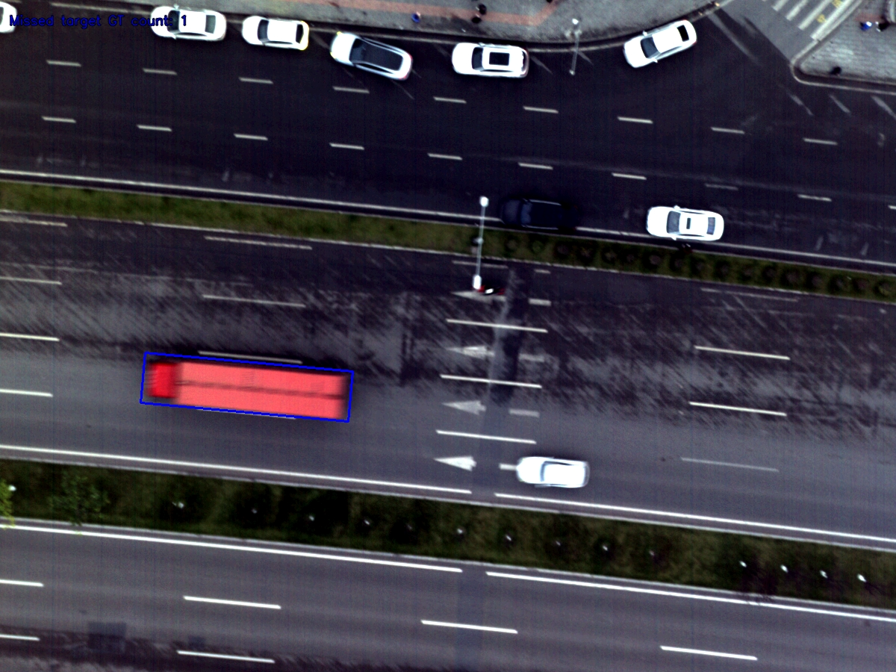
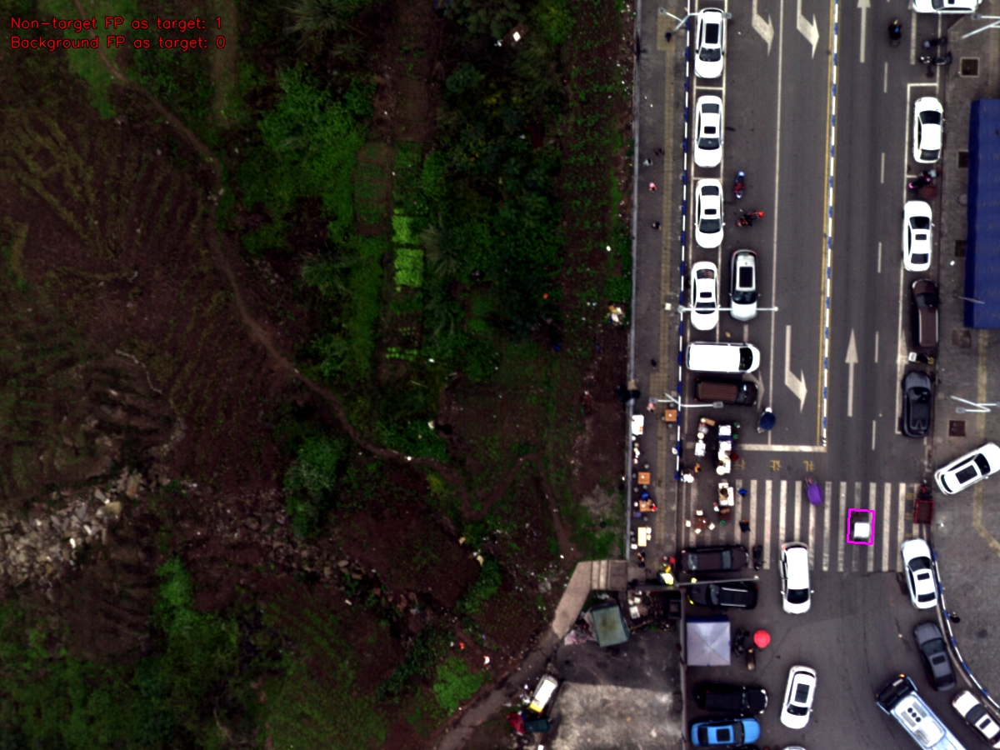
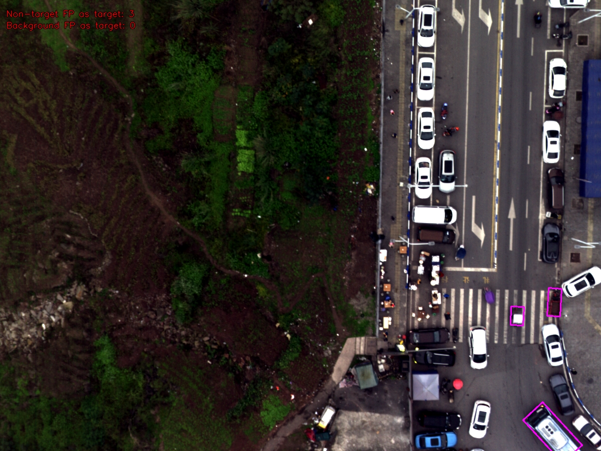
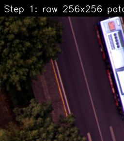
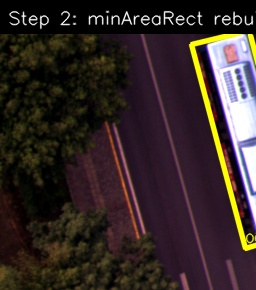
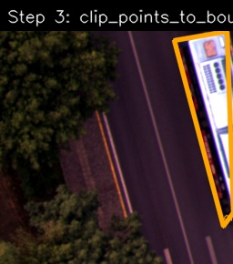

这篇博客记录一下我在高光谱/多光谱 OBB 检测任务里，针对细长目标和小目标在数据预处理方面的一些踩坑和思考。

针对高光谱/多光谱的 OBB 检测任务，我使用的是 yolo26n-obb 检测模型，默认不挂 P2 检测头（也就是 stride 为 4 的那一层）。

为什么要纠结 P2？看下采样之后目标还剩多少像素就明白了。对于细长目标和小目标，e.g. 平均短边 ≈ 12 像素：

- 不开启 P2：8× 下采样后，短边只剩约 1.5 像素；
- 开启 P2：4× 下采样后，短边还剩约 3 像素。

更极端一点，平均短边 ≈ 7 像素时：

- 不开启 P2：8× 下采样后，短边不足 1 像素；
- 开启 P2：4× 下采样后，短边还剩约 1.75 像素。

下面的 Table 1 是我训练 yolo26 时用到的部分 MODA 数据集统计信息：

| 类别 | 子集 | 目标数 | 图片数 | 图片占比(%) | 平均长边(px) | 平均短边(px) | 最长边(px) | 最短边(px) | 长边范围(px) | 短边范围(px) |
| --- | --- | --- | --- | --- | --- | --- | --- | --- | --- | --- |
| car | train 原始(1378图) | 23026 | 1275.0 | 92.53 | 66.3 | 30.1 | 363.5 | 13.3 | 29~363 | 13~166 |
| bus | train 原始(1378图) | 715 | 343.0 | 24.89 | 124.1 | 35.5 | 319.2 | 9.8 | 24~319 | 10~89 |
| van | train 原始(1378图) | 1800 | 766.0 | 55.59 | 64.6 | 28.5 | 392.8 | 15.3 | 35~393 | 15~167 |
| awning-bike | train 原始(1378图) | 2716 | 630.0 | 45.72 | 26.7 | 16.6 | 149.6 | 7.8 | 13~150 | 8~94 |
| truck | train 原始(1378图) | 1168 | 539.0 | 39.11 | 103.0 | 34.3 | 477.1 | 14.8 | 34~477 | 15~207 |
| tricycle | train 原始(1378图) | 924 | 498.0 | 36.14 | 52.8 | 23.9 | 273.8 | 6.2 | 22~274 | 6~118 |
| bike | train 原始(1378图) | 9935 | 855.0 | 62.05 | 26.7 | 10.1 | 163.1 | 3.4 | 11~163 | 3~87 |
| pedestrian | train 原始(1378图) | 15255 | 1151.0 | 83.53 | 13.0 | 10.5 | 87.3 | 4.5 | 5~87 | 4~71 |
| car | train 含过采样(2098条目) | 38709 | 1957.0 | 93.28 | 64.0 | 29.1 | 363.5 | 13.3 | 29~363 | 13~166 |
| bus | train 含过采样(2098条目) | 1294 | 569.0 | 27.12 | 119.0 | 34.1 | 319.2 | 9.8 | 24~319 | 10~89 |
| van | train 含过采样(2098条目) | 3318 | 1299.0 | 61.92 | 62.7 | 27.5 | 392.8 | 15.3 | 35~393 | 15~167 |
| awning-bike | train 含过采样(2098条目) | 4607 | 1039.0 | 49.52 | 25.7 | 16.0 | 149.6 | 7.8 | 13~150 | 8~94 |
| truck | train 含过采样(2098条目) | 2214 | 977.0 | 46.57 | 100.6 | 33.5 | 477.1 | 14.8 | 34~477 | 15~207 |
| tricycle | train 含过采样(2098条目) | 1703 | 875.0 | 41.71 | 50.0 | 22.6 | 273.8 | 6.2 | 22~274 | 6~118 |
| bike | train 含过采样(2098条目) | 15510 | 1328.0 | 63.30 | 25.9 | 10.0 | 163.1 | 3.4 | 11~163 | 3~87 |
| pedestrian | train 含过采样(2098条目) | 23601 | 1718.0 | 81.89 | 12.1 | 9.8 | 87.3 | 4.5 | 5~87 | 4~71 |
| car | val(251图) | 3677 | 224.0 | 89.24 | 60.7 | 27.5 | 392.1 | 18.0 | 39~392 | 18~183 |
| bus | val(251图) | 103 | 64.0 | 25.50 | 135.6 | 37.3 | 709.5 | 24.0 | 77~709 | 24~229 |
| van | val(251图) | 191 | 86.0 | 34.26 | 72.3 | 31.5 | 404.6 | 16.1 | 38~405 | 16~194 |
| awning-bike | val(251图) | 783 | 149.0 | 59.36 | 25.1 | 15.4 | 153.3 | 8.0 | 14~153 | 8~91 |
| truck | val(251图) | 124 | 83.0 | 33.07 | 119.3 | 37.0 | 378.4 | 21.0 | 52~378 | 21~163 |
| tricycle | val(251图) | 215 | 121.0 | 48.21 | 62.6 | 29.6 | 269.3 | 13.1 | 31~269 | 13~130 |
| bike | val(251图) | 3569 | 180.0 | 71.71 | 21.8 | 7.2 | 171.2 | 2.7 | 12~171 | 3~92 |
| pedestrian | val(251图) | 3322 | 225.0 | 89.64 | 12.5 | 10.1 | 71.5 | 5.0 | 7~72 | 5~64 |
| car | test(271图) | 2346 | 253.0 | 93.36 | 71.6 | 32.5 | 366.7 | 12.9 | 32~367 | 13~190 |
| bus | test(271图) | 378 | 86.0 | 31.73 | 119.4 | 34.1 | 282.7 | 27.3 | 63~283 | 27~86 |
| van | test(271图) | 422 | 163.0 | 60.15 | 86.0 | 38.1 | 404.9 | 18.6 | 45~405 | 19~165 |
| awning-bike | test(271图) | 295 | 114.0 | 42.07 | 31.0 | 19.2 | 128.6 | 9.1 | 12~129 | 9~75 |
| truck | test(271图) | 136 | 91.0 | 33.58 | 117.2 | 44.0 | 388.6 | 18.3 | 49~389 | 18~131 |
| tricycle | test(271图) | 257 | 115.0 | 42.44 | 64.5 | 29.2 | 191.1 | 7.9 | 22~191 | 8~79 |
| bike | test(271图) | 2544 | 190.0 | 70.11 | 31.7 | 11.1 | 115.1 | 6.0 | 12~115 | 6~47 |
| pedestrian | test(271图) | 2516 | 248.0 | 91.51 | 12.6 | 10.1 | 70.3 | 6.0 | 8~70 | 6~48 |

## 怎么样才能提升小目标的检测精度和召回率？

假设我们用的是 [MODA](https://github.com/shuaihao-han/MODA) 数据集：8×1200×900（通道×宽×高）的多光谱图像（MSI），整图推理时设 imgsz = 1184。

- 数据集 GitHub：<https://github.com/shuaihao-han/MODA>
- 论文：[MODA: The First Challenging Benchmark for Multispectral Object Detection in Aerial Images](https://arxiv.org/abs/2512.09489)

### Tile 切片 + stride + overlap + 滑动窗口推理

（1）首先，tile 切片并不会提升图像的分辨率，切片后的小目标该“看不清”还是“看不清”。

（2）其次，多类别检测任务里目标尺寸跨度很大（比如 Table 1 里的长边/短边范围），切片时很容易把目标截断在 patch 边缘。对被截断的目标，两种处理方式各有各的坑：

- **直接丢弃（不再标注）**：模型会把这部分真实目标的特征当作背景来学习，可能漏检，即 FN 升高，如图 1；
- **当作完整正样本参与训练**：模型会把不完整的目标特征当成完整目标来学，可能出现 FP 升高（背景误检成目标）、把大目标的一部分当完整目标框出来，甚至把特征相似的其他目标误检成这个类，如图 2、3、4。

（3）另外，用切片后的 patch 训练，模型能看到的上下文信息变少了。而且：

- **如果是 tile 训练、整图推理部署**：训练数据和推理数据的分布就不一致了，在 patch 上验证到的性能提升，放到整图上不一定有，甚至可能反过来拉低。举个真实例子：我把 yolo26-obb head 里的下采样从步长为 2 的 Conv 换成小波下采样，patch 上 mAP50-95 涨了 0.04，但整图推理时 mAP50-95 反而掉了 0.04。
- **如果是 tile 训练、整图滑动窗口推理**：滑动窗口过程中对同一目标重复检测是躲不掉的，只能上 NMS 去重。但 yolo26 的设计和优势本来就是奔着无 NMS 去的，再回头接 NMS 就有点本末倒置了——还不如舍弃 one-to-one 分支、直接用 one-to-many 分支；而且转 ONNX 部署时还要额外处理 NMS，麻烦得很。

（4）最后，如果实在没办法——MSI/HSI 通道数多、自己电脑训练确实吃力，必须切 patch 训练——那对于边缘截断的目标，可以用 IoF 阈值决定保留还是丢弃，e.g. IoF ≥ 0.7 时保留。但要注意：

一般情况下，对于越界目标（包括坐标出现负数的），OBB 检测任务里 Ultralytics 官方的做法是直接丢掉这个目标，甚至丢掉整张图。如果只丢越界目标、不丢整图，就会碰到（2）里说的那些情况；但 tile 时越界目标本来就频繁出现，整图都丢的话就没几张图能训了。

所以对于越界目标，只能设置一个较高的 IoF 阈值：小于阈值的直接舍弃、不标注；大于阈值的用 minAreaRect 重建成标准旋转矩形。重建后矩形的四个顶点不一定都在 patch 内，还需要 clip_points_to_bounds 做顶点钳制，把四个顶点强行拉回图内。但钳制可能产生不规则的四边形，这种框已经不适合做 OBB 训练了，我的建议是直接舍弃。相关可视化见图 5、6、7。

## 总结

综上所述，还是整图训练 + 整图推理比较靠谱。对于苦逼的 MSI/HSI 图像任务，为了防止 OOM，可以参考以下设置：

训练前显存预检自动降 batch + AMP + 关 pin_memory + 磁盘缓存 + 验证小 batch + 关 mosaic/多尺度

不知道怎么设置的话，问问亲爱的 DEEPSEEK 大肥鲸。

P.S. 这篇博客还没真正解决细长目标和小目标的检测问题，只是聊了聊数据预处理方面的坑。细长目标和小目标检测具体怎么解，我还在探索中，后续会更新相关思考。
